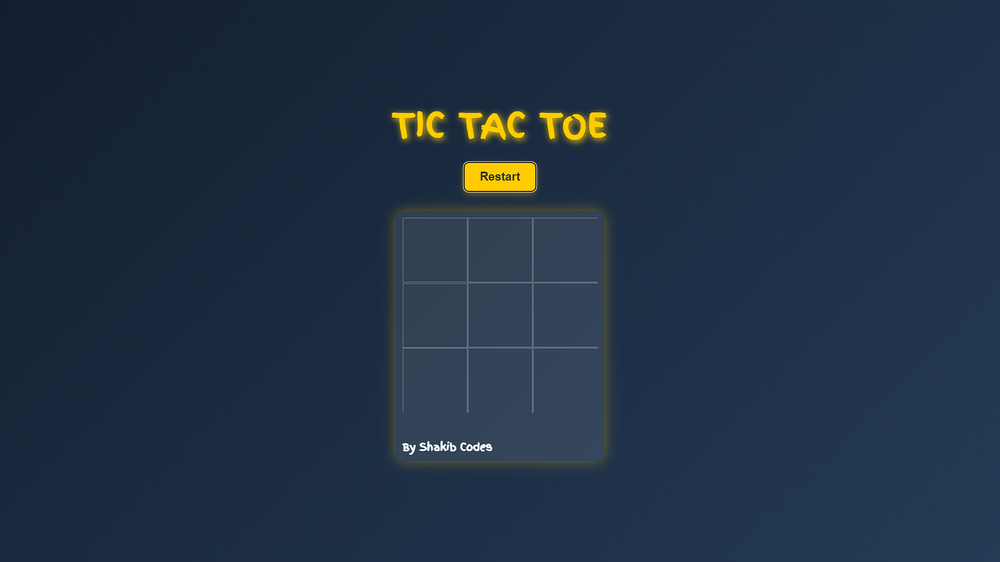

# 🏆 Tic-Tac-Toe - A Modern & Stylish Game

**Hey, it's me [ShakibCodes](https://github.com/ShakibCodes)!** 👋  

> A simple yet visually appealing Tic-Tac-Toe game with smooth animations and an elegant UI.

## 🎮 Features
✅ **Sleek UI** – Modern, minimalistic, and easy on the eyes.
✅ **Hover Effects** – Smooth scaling effect when hovering over boxes.
✅ **Winning Animation** – The winning blocks light up with a pulsing glow.
✅ **Custom Cursor** – A unique custom cursor for a playful experience.
✅ **Responsive Design** – Works on desktops, tablets, and mobile devices.



## 🚀 Live Demo
🔗 **[Play Now](https://ShakibCodes.github.io/tic-tac-toe/)**

## 🖥️ Technologies Used
- **HTML**
- **CSS (Animations & Effects)**
- **JavaScript**

## 📸 Preview


## 🎲 How to Play
1️⃣ Click on any empty tile to place your mark (X or O).
2️⃣ Players take turns marking the 3×3 grid.
3️⃣ The first player to get 3 in a row **(vertically, horizontally, or diagonally)** wins.
4️⃣ Click "Restart" to reset the board and play again!

## 📂 Setup & Installation
1. Clone the repository:
   ```bash
   git clone https://github.com/YOUR_GITHUB_USERNAME/tic-tac-toe.git
   ```
2. Open `index.html` in your browser and enjoy!

## 🏆 Contribution
Feel free to fork this repository and add your own cool effects! PRs are welcome! 🚀

## 📜 License
This project is licensed under the **MIT License**.

---  


